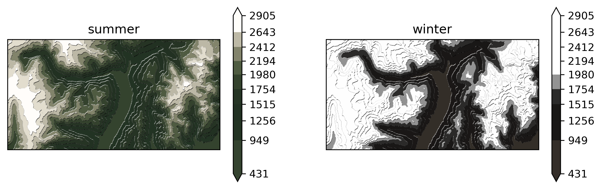

# map helpers

useful / playful functions for making maps.

is any of this code perfect and error free? no. absolutely not.

feel free to use/modify/adapt and improve.
if you make any maps with the code here, it'd be nice to see what you've done. feel free to share it with me.

## examples
there is some example code in the [`examples.ipynb`](examples.ipynb) notebook

and here are some outputs:

### tanaka (illuminated) contours


### flowy topography


### ridge map


### *local* and *seasonal* color-map



## installation / usage
(*there is probably a better way to do this, but this is how i use it*)

clone this repo, and `cd` into the directory

to install into a conda environment:

`conda-develop . -n <env-name>`

then

`import mapping_funcs as mf`

### dependencies
the conda environment is in: [`environment.yml`](environment.yml).
this includes *lots* of other packages that are not reqd. it just happens to be the environment that i use.

at a minimum the required packages are:

```
contourpy, cartopy, geopandas, matplotlib, numpy, pystac-client, pyproj, planetary-computer, rasterio, rioxarray, shapely, scipy, shapelysmooth, skimage, stackstac, xarray, xarray-spatial
```

## attribution
ideally provide a link back to here, or [tlohde.blog](https://tlohde.blog/)
